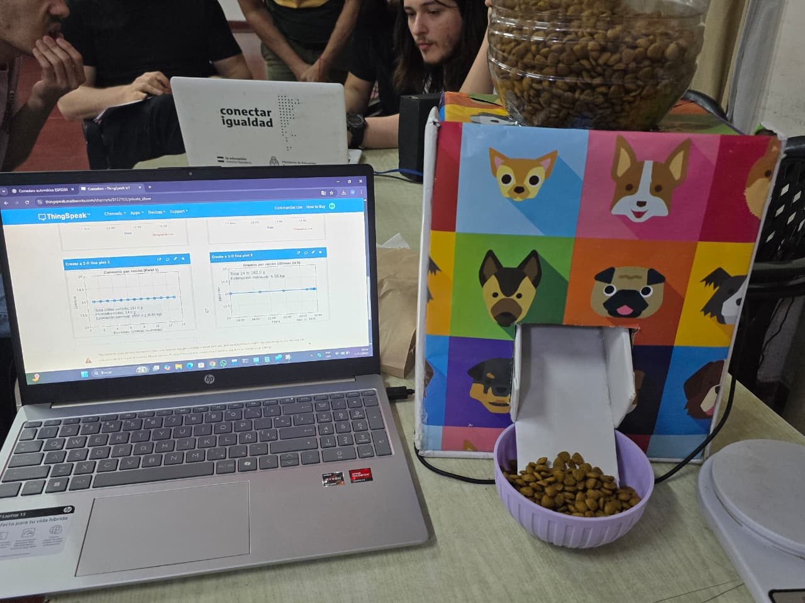

# Comedero Automático Inteligente (IoT)

Proyecto académico basado en ESP8266 que integra hardware + firmware + interfaz web embebida.

## Descripción

Sistema IoT diseñado para calcular y dispensar porciones de alimento de manera automática y precisa.

El dispositivo ejecuta un servidor web interno que permite configurar:

- Horarios de alimentación
- Peso del perro
- Tamaño de porciones
- Tipo de alimento

La interfaz web (HTML, CSS y JavaScript) se encuentra embebida directamente en el firmware del microcontrolador.

## Tecnologías Utilizadas

ESP8266 (NodeMCU)  
Arduino IDE  
Programación en C/C++ (.ino)  
HTML / CSS / JavaScript (web embebida)  
Comunicación HTTP  
Sincronización horaria NTP  
ThingSpeak (visualización de datos en la nube)

## Funcionalidades

- Cálculo automático de raciones
- Sistema de dispensación mediante servo
- Sincronización horaria vía NTP
- Panel web de configuración
- Visualización de datos en la nube

## Prototipo

